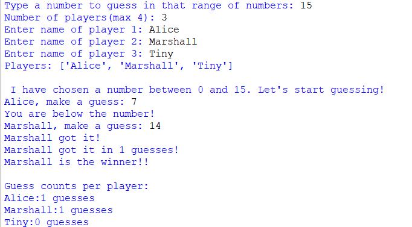

# 🎯 Multiplayer Number Guesser Game (Python)

A fun and simple *multiplayer number guessing game* written in Python!  
1–4 players can play, and each player takes turns guessing until someone wins.  
The game also tracks the number of guesses each player takes.

---

## 🖥 Features
- Supports *1 to 4 players*
- *Turn-based gameplay*
- Tracks *guesses per player*
- Announces the *winner* and their guess count
- Shows *total guesses per player* at the end

---

## 🎮 How to Play
1. Run the Python file:

   ```bash
   python number_guesser.py

2. Enter:

The maximum number for guessing

The number of players (1–4)

Each player's name


3. Players take turns guessing until one player finds the number.


4. The game will display the winner and guess counts for all players.


---

📂 Example Gameplay

Type a number to guess in that range of numbers: 10
Number of players (max 4): 2
Enter name of player 1: Alice
Enter name of player 2: Bob

Players: ['Alice', 'Bob']

I have chosen a number between 0 and 10. Let's start guessing!

Alice, make a guess: 5
Too low!
Bob, make a guess: 8
Too high!
Alice, make a guess: 7

🎉 Alice got it in 2 guesses! 🎉

Guess counts per player:
Alice: 2 guesses
Bob: 1 guesses


---

🛠 Requirements

Python 3.x installed on your system


---

📸 Screenshot




---

👤 Author

Tharshiniie

---
